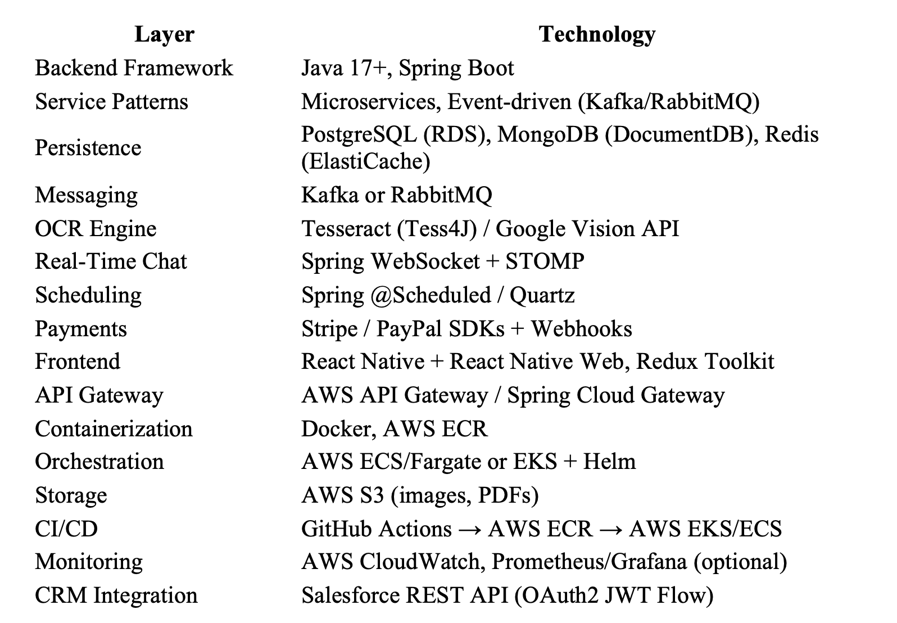
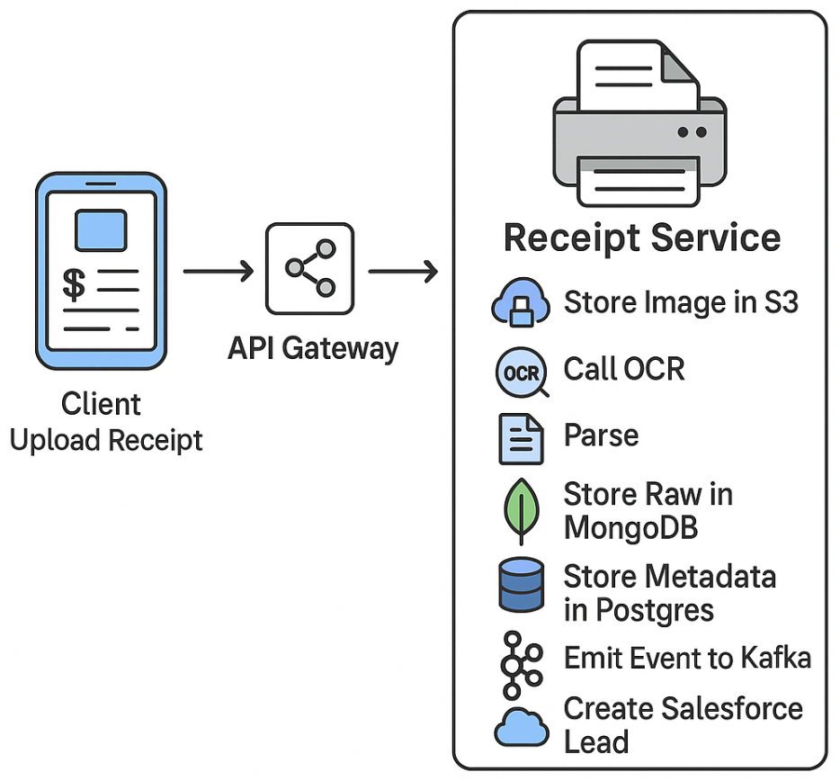
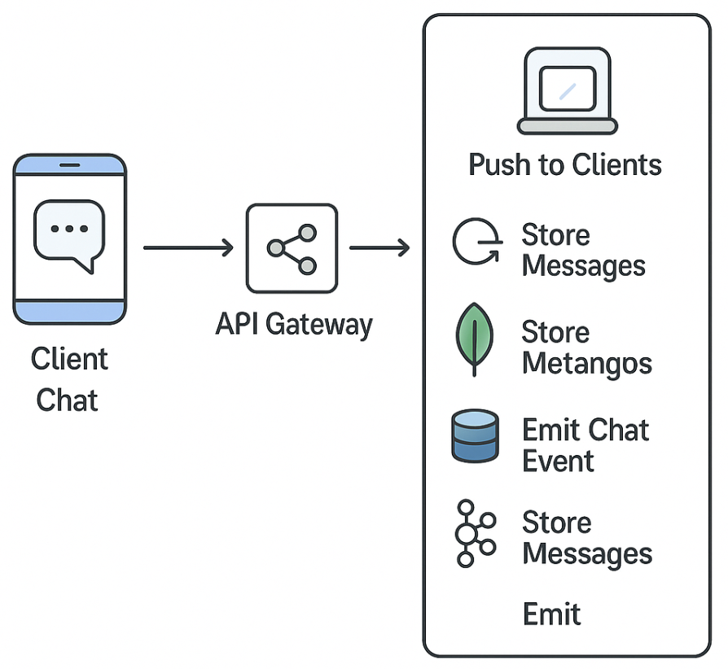
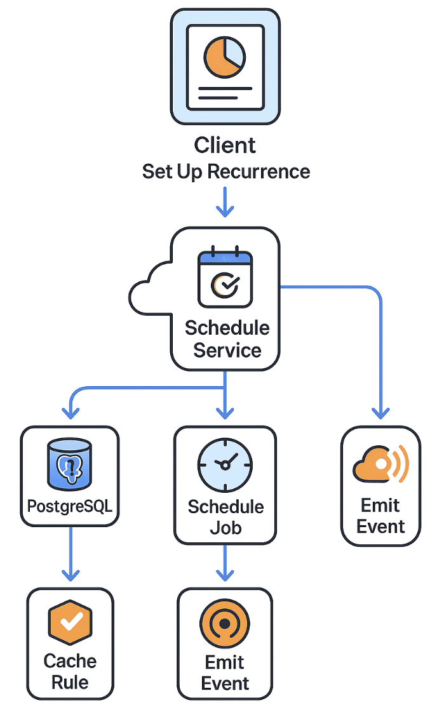
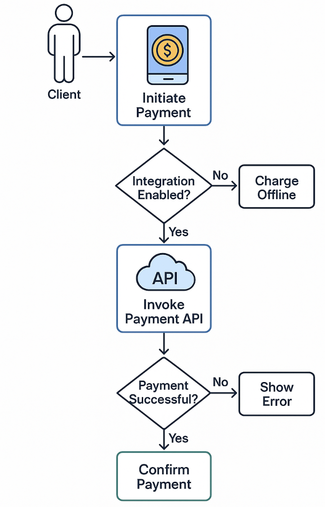
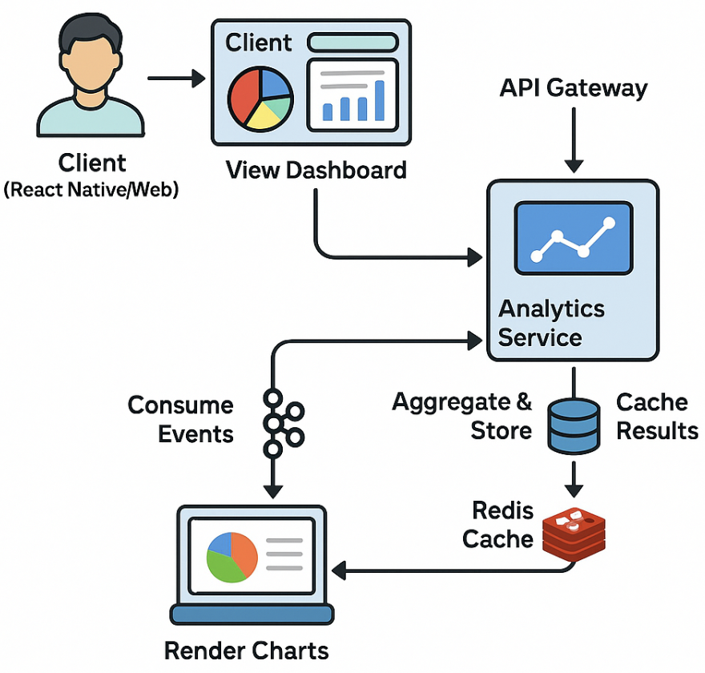

# BroPay
We split. You chill!

------
 
## 1. Project Overview

  **Primary Goal:** Build an intuitive, full-stack expense-splitting application that enables users to upload receipts, automatically parse line items with OCR, negotiate shares 
  via real-time chat, schedule recurring expenses, automate reminders and payments, and gain budget insights—all deployed on AWS and integrated with Salesforce for CRM 
  workflows.

 -----
 
## 2. Requirements

  ## 2.1 User Requirements
  
  **•	Account Management:** Users can register, log in, and manage profiles.
  
  **•	Receipt Entry:** Users can upload a photo or image of a receipt.
  
  **•	Expense Split:** Users can review parsed items and confirm how costs are split.
  
  **•	Chat & Negotiation:** Users can negotiate shares via in-app real-time chat.
  
  **•	Recurring Expenses:** Users can subscribe to recurring bills (rent, subscriptions).
  
  **•	Payments & Reminders:** Users receive reminders, tap “Pay Now,” and complete payments via integrated gateways.
  
  **•	Analytics Dashboard:** Users view trends, categories, and summary charts for spending.

-----

## 2.2 Functional Requirements

**•	OCR Parsing:** Extract line items (description + price) from receipt images.

**•	Split Algorithm:** Calculate net owed amounts between participants and persist results.

**•	WebSocket Chat:** Provide reliable, persisted chat per expense event.

**•	Scheduler:** Create and run recurrence jobs, auto-generate future events.

**•	Payment Integration:** Generate and handle payment sessions via Stripe/PayPal APIs.

**•	Event Bus:** Publish/consume domain events (Kafka/RabbitMQ) for decoupled workflows.

**•	Salesforce Sync:** Create Leads/Tasks on specific triggers (new user, late payment).

**•	CI/CD:** Automated build, test, and deploy pipeline using GitHub Actions and AWS ECR/EKS.

-----

## 2.3 Non-Functional Requirements

**•	Performance:** Receipt parsing & expense splitting must complete <5s.

**•	Scalability:** Microservices must scale horizontally under load.

**•	Reliability:** 99.9% uptime, durable storage on AWS-managed services.

**•	Security:** JWT authentication, TLS for all endpoints, secrets in AWS Secrets Manager, least-privilege IAM.

**•	Maintainability:** Dockerized services, clear API contracts (Open API), modular code structure.

**•	Usability:** Consistent UI/UX across web & mobile (React Native + React Native Web).

**•	Monitoring:** Centralized logging (CloudWatch), metrics & alerts for service health.

 -----
 
## 3. Technical Stack

------

## 4. System Workflow

**1. Client Action:** User initiates an action (e.g., upload receipt) in the mobile/web UI.

**2. API Gateway:** Authenticates (JWT), routes request to the appropriate microservice.

**3. Microservice Processing:** Service executes business logic, interacts with data stores, and emits domain events.

**4.	External Integrations:** Calls external APIs (OCR, Payments, Salesforce, S3) as needed.

**5.	Data Persistence:** Writes to PostgreSQL, MongoDB, and caches in Redis. Events published to Kafka.

**6.	Response:** Service returns results to the client; UI updates accordingly.

**7.	Analytics:** Aggregation service consumes events to update dashboards; data cached for UI.
(Refer to high-level flowchart image)

 ----
 
## 5. Development Steps (Sprints)

### Sprint 0: Environment & Planning

1.	Set up GitHub repo, branching strategy (main/dev/feature).

2.	Provision AWS sandbox (IAM, VPC, RDS, DocumentDB, Redis).

3.	Define ER diagrams, OpenAPI spec for core endpoints.

4.	Create initial backlog & sprint plan.

### Sprint 1: Hello World & CI/CD

1.	Bootstrap Spring Boot service (GET /health).

2.	Create React Native/Web skeleton with npm start.

3.	Write Dockerfiles for both services.

4.	Add GitHub Actions to build & push Docker images.

### Sprint 2: Receipt Upload & OCR

1.	Implement /api/receipts/upload endpoint.

2.	Integrate Tess4J; parse raw text & persist to MongoDB/Postgres.

3.	Store images in S3 and emit receipt.processed event.

4.	Update UI to upload image & display parsed items.

### Sprint 3: Expense Split Logic & Persistence

1.	Create ExpenseService with split algorithm.

2.	Design Postgres schema & JPA entities for expenses/line-items.

3.	Build React review & confirm UI.

4.	Persist splits and return summary.

### Sprint 4: Real-Time Chat

1.	Set up Spring WebSocket endpoints (STOMP).

2.	Persist chat messages to MongoDB and publish events.

3.	Build chat UI with live updates.

4.	Ensure reconnection & history load.

### Sprint 5: Recurring Jobs & Reminders

1.	Define recurrence rules entity & UI form.

2.	Use @Scheduled or Quartz to generate events & reminders.

3.	Cache schedules in Redis; emit reminder events.

4.	Integrate AWS SNS or in-app push for notifications.

### Sprint 6: Payment Integration

1.	Connect with Stripe/PayPal SDK to create payment sessions.

2.	Handle webhooks → update Postgres & emit events.

3.	Build “Pay Now” UI flow.

4.	Create Salesforce Task on failed payments.

### Sprint 7: Analytics Dashboard

1.	Build AnalyticsService to consume events & aggregate metrics.

2.	Persist summaries in Postgres & cache in Redis.

3.	Create React dashboard with charts (Recharts).

4.	Secure endpoints & optimize queries.

### Sprint 8: Hardening & Deployment

1.	Write unit, integration, and E2E tests (Cypress/Detox).

2.	Conduct security review (JWT, HTTPS, IAM policies).

3.	Configure Helm charts & deploy to EKS/ECS.

4.	Set up CloudWatch dashboards & alerts.

 ----
 
## 6. Feature Details & Diagrams

### •	Receipt Upload

   

### •	Chat Service

  
 
### •	Recurring Setup

 

### •	Payment Flow

  
 
### •	Analytics Dashboard

  
 
